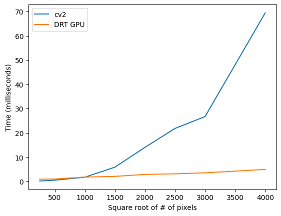

# drt-gpu
GPU enabled computation of the DRT algorithm for Image Moments

This was mostly to dip my toes into GPU programming with a non trivial example that isn't readily
available online already. The code in this repository uses the numba python library to take advantage of a GPU device and writing CUDA compatible functions.

The DRT algorithm for Image Moment calculation can be found at https://www.github.com/michael-diggin/ImageMoments, and a paper going into detail can be found on arxiv at https://arxiv.org/abs/2008.11083

When benchmarked against the implementation from OpenCV (using the python cv2 library), on increasing image array sizes, the GPU code beats it when the array is large enough (no surprises there). This was done using the free tier of Google Collab with a T4 GPU.

